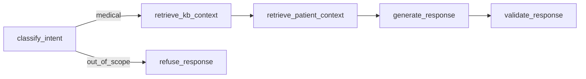

# FIAP IA Tech Challenge — Phase 3 Medical Assistant

This repository contains the full project evolution for the FIAP Tech Challenge, ending in a Phase 3 medical assistant that combines:

- Breast-cancer ML artifacts from earlier phases
- Fine-tuning of a TinyLlama-based local model
- LangGraph orchestration
- KB retrieval over medical documents
- Structured synthetic patient records
- Guardrails, citations, and audit logging

## Phase 3 Architecture



Runtime policy:

- Primary assistant model: fine-tuned TinyLlama adapter
- Gemini: optional fallback only
- Default fallback behavior: disabled

## Project Structure

```text
.
├── artifacts/
│   ├── finetune_checkpoints/
│   ├── logs/
│   └── vectorstore/
├── data/
│   ├── finetune/
│   ├── kb/
│   ├── patients/
│   └── wisconsin_breast_cancer.csv
├── docs/
│   ├── reports/
│   └── requirements/
├── scripts/
│   ├── prepare_finetune_data.py
│   ├── fine_tune.py
│   ├── eval_finetune.py
│   ├── build_kb.py
│   └── run_assistant.py
├── src/
│   ├── assistant/
│   ├── llm/
│   ├── models/
│   └── genetic/
└── tests/
```

## Environment Setup

1. Create and activate a virtual environment:

```bash
python3 -m venv .venv
source .venv/bin/activate
```

2. Install dependencies:

```bash
python3 -m pip install --upgrade pip
python3 -m pip install -r requirements.txt
```

3. Optional `.env` settings:

```bash
GEMINI_API_KEY=...
GEMINI_MODEL=gemini-2.0-flash
ASSISTANT_ALLOW_FALLBACK=false
```

## Fine-Tuning Workflow

Prepare the instruction dataset:

```bash
python3 scripts/prepare_finetune_data.py --total 625 --seed 42
```

Train the LoRA adapter:

```bash
python3 scripts/fine_tune.py --epochs 1 --batch-size 2
```

Evaluate base vs fine-tuned model:

```bash
python3 scripts/eval_finetune.py --split val --num-samples 10
```

Artifacts:

- Adapter: `artifacts/finetune_checkpoints/final_adapter/`
- Logs: `artifacts/logs/finetune.jsonl`

## Knowledge Base Build

Build the KB text files and Chroma vector store:

```bash
python3 scripts/build_kb.py
```

Artifacts:

- KB documents: `data/kb/`
- Vector store: `artifacts/vectorstore/`

## Structured Patient Records

Synthetic structured records live in `data/patients/`.

Each file uses this schema:

```json
{
  "patient_id": "P-0001",
  "demographics": {"age": 54, "sex": "female"},
  "chief_complaint": "Palpable breast lump in left breast",
  "history": {
    "personal_history": ["dense breasts"],
    "family_history": ["mother with breast cancer at 62"],
    "comorbidities": ["hypertension"]
  },
  "current_medications": ["losartan 50 mg daily"],
  "recent_exams": {
    "mammography": "BI-RADS 4 lesion in left breast",
    "ultrasound": "solid irregular hypoechoic nodule, 1.8 cm"
  },
  "recent_labs": {"cbc": "within normal limits", "cmp": "within normal limits"},
  "imaging_summary": "Suspicious left breast lesion with recommendation for tissue diagnosis",
  "clinician_notes": "Patient reports lump noticed 3 weeks ago; no fever; mild local tenderness.",
  "ml_context": {
    "malignancy_probability": 0.81,
    "model_label": "Malignant",
    "model_name": "RF"
  },
  "last_updated": "2026-03-23"
}
```

## Run the Assistant

KB-only mode:

```bash
python3 scripts/run_assistant.py
```

Patient-context mode:

```bash
python3 scripts/run_assistant.py --patient-id P-0001
```

Legacy ML-context mode without patient record:

```bash
python3 scripts/run_assistant.py --features "17.99,10.38,122.8,1001,..."
```

Expected behavior:

- The assistant uses the local fine-tuned adapter by default.
- If `ASSISTANT_ALLOW_FALLBACK=false`, adapter load failure returns an error instead of silently switching models.
- If `ASSISTANT_ALLOW_FALLBACK=true`, Gemini may be used only when the local model cannot initialize.
- Final answers include:
  - `Clinical Context Source: patient_record:<id>` when patient context is used
  - `Knowledge Base Sources: ...` when KB docs are used

## Testing

Run the test suite:

```bash
python3 -m pytest -q
```

Recommended smoke checks:

```bash
python3 -m pytest -q tests/test_guardrails.py tests/test_patient_store.py tests/test_audit_logger.py
python3 -m pytest -q tests/test_assistant_graph.py
```

## Logging and Audit

Structured logs are written to `artifacts/logs/`.

Key files:

- `artifacts/logs/finetune.jsonl`
- `artifacts/logs/assistant.jsonl`
- `artifacts/logs/audit.jsonl`

Audit entries include:

- `user_query`
- `retrieved_docs`
- `model_response`
- `guardrail_triggered`
- `patient_id`
- `patient_context_used`
- `kb_sources`
- `patient_source`

## Data Provenance

Phase 3 uses public and synthetic data to simulate the challenge requirement for internal medical data:

- MedQuAD
- PubMedQA
- Synthetic oncology instruction pairs
- Synthetic structured patient records

This repository does not contain real hospital PHI.

## Report and Demo

Phase 3 report:

- [Relatorio_Tecnico_Tech_Challenge_Fase3.md](/Users/theonetto/www/pos-ia-dev/fiap-ia-challenge-phase-2/docs/reports/Relatorio_Tecnico_Tech_Challenge_Fase3.md)

Demo/video placeholder:

- Add the final submission video link here before delivery.
