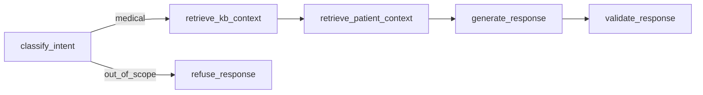

# Relatorio Tecnico — Tech Challenge Fase 3

## 1. Introducao e Objetivo

Esta fase amplia o projeto das fases anteriores com um assistente virtual medico focado em oncologia. O objetivo foi integrar um modelo LLM ajustado por fine-tuning a um fluxo LangGraph com recuperacao de contexto, uso de registros estruturados do paciente, guardrails de seguranca e rastreabilidade por logs.

## 2. Dataset, Anonimizacao e Curadoria

O repositorio usa dados publicos e sinteticos para simular o requisito de dados internos do hospital:

- MedQuAD como base principal de perguntas e respostas medicas
- PubMedQA como complemento opcional
- exemplos sinteticos de oncologia para cobrir lacunas
- registros sinteticos estruturados de pacientes para simular prontuarios

O script `scripts/prepare_finetune_data.py` aplica:

- filtragem por relevancia oncologica
- deduplicacao por pergunta
- anonimização por regex para datas, ids, nomes, telefones e emails
- split reprodutivel de treino e validacao

## 3. Arquitetura de Fine-Tuning

O modelo base escolhido foi `TinyLlama/TinyLlama-1.1B-Chat-v1.0`, ajustado via LoRA com:

- `r=8`
- `lora_alpha=16`
- `lora_dropout=0.05`
- treinamento supervisionado com `trl.SFTTrainer`

O adapter final e salvo em `artifacts/finetune_checkpoints/final_adapter/`.

## 4. Avaliacao do Modelo

O repositorio inclui:

- `scripts/eval_finetune.py` para comparar base vs fine-tuned
- logs em `artifacts/logs/finetune.jsonl`
- checkpoints por epoca

A avaliacao foi estruturada para medir a qualidade do modelo fine-tunado sobre o conjunto de validacao e registrar as metricas de comparacao com o modelo base.

## 5. Arquitetura do Assistente

O assistente foi reorganizado para usar o modelo fine-tunado local como gerador principal, com Gemini apenas como fallback operacional opcional.

### Fluxo LangGraph

### Componentes principais

- `src/assistant/local_llm.py`: carrega o modelo base e o adapter LoRA
- `src/assistant/retriever.py`: recupera contexto da base de conhecimento
- `src/assistant/patient_store.py`: carrega registros sinteticos estruturados do paciente
- `src/assistant/graph.py`: orquestra classificacao, recuperacao, geracao e validacao

## 6. Registros Estruturados do Paciente

Para atender ao requisito de consultas em base estruturada, foram adicionados registros sinteticos em `data/patients/`, contendo:

- identificador do paciente
- dados demograficos
- queixa principal
- historico
- medicamentos em uso
- exames e laboratoriais recentes
- resumo de imagem
- notas clinicas
- contexto do modelo de ML das fases anteriores
- data de atualizacao

Esses dados sao recuperados por `patient_id` e incorporados ao prompt final do assistente.

## 7. Guardrails, Logging e Explainability

Os mecanismos de seguranca implementados incluem:

- recusa de perguntas fora do escopo
- recusa de pedidos de prescricao direta
- suavizacao de linguagem de diagnostico definitivo
- disclaimer obrigatorio em toda resposta
- resposta segura quando o contexto recuperado e insuficiente

Para rastreabilidade:

- toda interacao gera um evento em `artifacts/logs/audit.jsonl`
- as respostas incluem citacoes explicitas de:
  - `patient_record:<id>` quando ha contexto do paciente
  - arquivos da base de conhecimento quando ha RAG

## 8. Limitacoes

- os dados do paciente sao sinteticos e nao representam um prontuario hospitalar real
- a qualidade final do assistente depende da disponibilidade do adapter fine-tunado e das dependencias locais
- a base de conhecimento atual usa documentos publicos transformados em arquivos texto

## 9. Conclusao

Com esta fase, o projeto passa a contar com um assistente medico modularizado em Python, com:

- modelo fine-tunado integrado ao fluxo de resposta
- recuperacao de conhecimento por KB
- uso de registros estruturados do paciente
- LangGraph para orquestracao
- explicabilidade por citacoes
- guardrails e auditoria para seguranca
