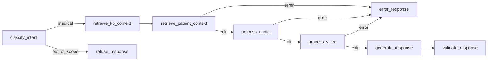

# Relatorio Tecnico - Tech Challenge Fase 4

## 1. Introducao e Objetivo

A Fase 4 amplia o assistente medico das fases anteriores com analise multimodal para saude da mulher. A solucao combina texto, audio e video em um fluxo unico de apoio a triagem clinica, mantendo o LangGraph como orquestrador principal.

As modalidades escolhidas foram:

- Audio de consulta, com foco em sinais de depressao pos-parto, ansiedade, violencia, negligencia e fadiga hormonal.
- Video clinico, com foco em deteccao de sangramento anomalo em frames simulados de laparoscopia.
- Texto clinico ja existente no assistente, com recuperacao de base de conhecimento e registros estruturados sinteticos de pacientes.

## 2. Fluxo Multimodal

O fluxo final preserva as etapas da Fase 3 e adiciona dois novos nos opcionais entre a recuperacao de contexto do paciente e a geracao da resposta:



O estado do assistente foi estendido com campos multimodais opcionais:

- `audio_path`
- `audio_transcript`
- `audio_analysis`
- `video_path`
- `video_report`

Quando audio ou video nao sao informados, os respectivos nos pulam processamento e o fluxo continua normalmente. Quando presentes, os laudos gerados sao incorporados ao prompt final junto com o contexto do paciente e da base de conhecimento.

## 3. Modelos Aplicados por Modalidade

### Audio

O pipeline de audio possui duas etapas:

1. `transcribe(audio_path)`: transcreve o arquivo de audio usando a API Whisper da OpenAI, com modelo padrao `whisper-1`.
2. `analyze_transcript(transcript, client)`: envia o transcript ao cliente LLM configurado, com preferencia para `OPENAI_MODEL=gpt-4o-mini`, e retorna um laudo clinico estruturado.

O prompt clinico exige cobertura de:

- sinais compativeis com depressao pos-parto;
- sinais de ansiedade;
- possiveis sinais de violencia, coercao, negligencia ou falta de seguranca;
- fadiga hormonal, privacao de sono e exaustao fisica ou emocional.

O laudo evita diagnostico definitivo e diferencia evidencias explicitas de hipoteses.

### Video

O pipeline de video usa YOLOv8 para detectar a classe customizada `anomalous_bleeding`.

Os dados foram gerados programaticamente por `scripts/generate_synthetic_data.py`:

- 100 imagens sinteticas;
- 80 imagens de treino e 20 de validacao;
- fundo escuro simulando cavidade laparoscopica;
- manchas vermelhas aleatorias simulando sangramento;
- labels YOLO geradas automaticamente;
- classe unica: `anomalous_bleeding`.

O treinamento foi executado por `scripts/train_yolo.py` com:

- modelo base: `yolov8n.pt`;
- epocas: 20;
- tamanho de imagem: 640;
- batch: 8;
- dispositivo: `mps`;
- saida: `artifacts/yolo/bleeding_yolov8n/weights/best.pt`.

A inferencia em video e feita por `src/multimodal/video.py`, que processa frames, filtra deteccoes por confidence, registra bounding boxes e gera um laudo textual com contagem de achados, confidence medio e classificacao de risco.

## 4. Resultados

### Metricas do YOLOv8

Validacao final sobre 20 imagens sinteticas com 38 instancias anotadas:

| Metrica | Valor |
| --- | ---: |
| mAP50 | 0.9950 |
| Precision | 0.9984 |
| Recall | 1.0000 |

O treinamento registrou os resultados em `artifacts/logs/yolo_training.jsonl` e salvou o modelo final em `artifacts/yolo/bleeding_yolov8n/weights/best.pt`.

### Exemplo de anomalia visual detectada

Em videos analisados com o modelo treinado, cada deteccao de sangramento anomalo gera uma linha no laudo com:

- indice do frame;
- timestamp aproximado;
- classe detectada;
- confidence;
- bounding box no formato `xyxy`.

O relatorio final classifica o risco como:

- baixo: nenhuma deteccao;
- moderado: poucas deteccoes ou confidence medio abaixo do limite alto;
- alto: cinco ou mais deteccoes, ou confidence medio maior ou igual a 0.60.

### Exemplo de achados no audio

Para um transcript de consulta pos-parto, o pipeline retorna um laudo com:

- resumo clinico;
- sinais observados por categoria;
- nivel de alerta;
- perguntas de acompanhamento recomendadas;
- encaminhamentos sugeridos;
- limitacoes.

O objetivo e apoiar triagem e priorizacao, nao substituir avaliacao medica, psicologica ou assistencial.

## 5. Integracao com o Assistente

O CLI principal aceita as novas entradas:

```bash
python3 scripts/run_assistant.py --patient-id P-0001 --audio consulta.wav --video procedimento.mp4
```

O fluxo integrado:

1. classifica a pergunta como medica ou fora de escopo;
2. recupera contexto da base de conhecimento;
3. carrega registro sintetico do paciente, quando informado;
4. transcreve e analisa audio, quando informado;
5. analisa video com YOLOv8, quando informado;
6. gera resposta clinica com contexto textual, estruturado e multimodal;
7. valida a resposta com guardrails, citacoes e fontes.

A resposta final inclui referencias explicitas para audio e video quando essas modalidades foram usadas.

## 6. Limitacoes e Seguranca

- Os frames de video sao sinteticos e nao representam variabilidade real de videos cirurgicos.
- As metricas do YOLOv8 refletem o conjunto sintetico gerado localmente; nao devem ser interpretadas como desempenho clinico real.
- A analise de audio depende da qualidade da gravacao e da transcricao.
- O laudo de audio e apoio de triagem e nao produz diagnostico definitivo.
- O projeto nao contem PHI real; dados de pacientes e imagens sao sinteticos.
- A implementacao usa servicos gerenciados via OpenAI API para transcricao e analise clinica. Azure Cognitive Services nao foi integrado nesta versao.

## 7. Conclusao

A Fase 4 entrega uma extensao multimodal funcional do assistente medico:

- audio via Whisper + GPT-4o-mini;
- video via YOLOv8 customizado para `anomalous_bleeding`;
- integracao dos laudos ao LangGraph existente;
- CLI standalone para audio e video;
- CLI integrado para perguntas clinicas com contexto multimodal;
- rastreabilidade por logs e fontes na resposta final.

Com isso, o projeto passa a demonstrar processamento combinado de texto, audio e video para apoio a monitoramento e triagem em saude da mulher.
