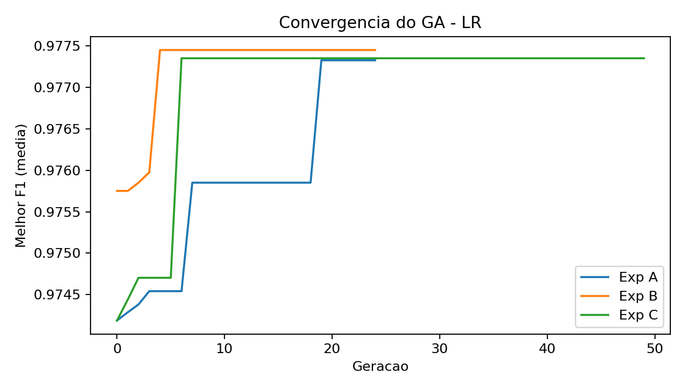
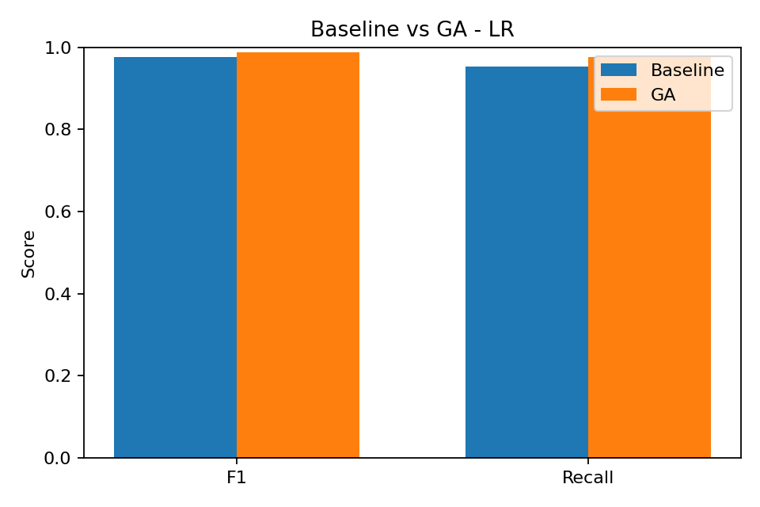
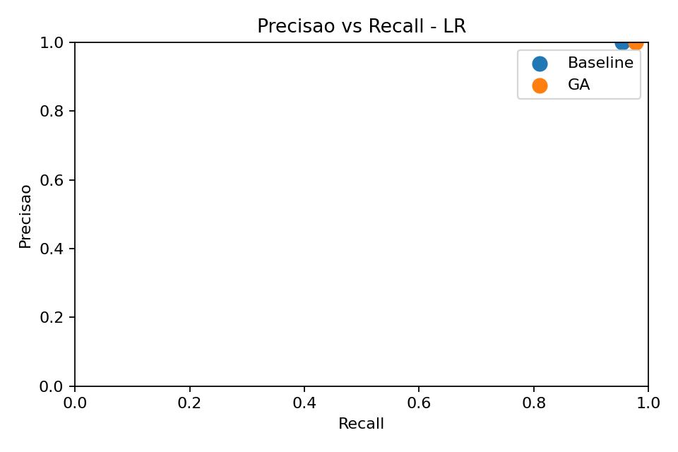
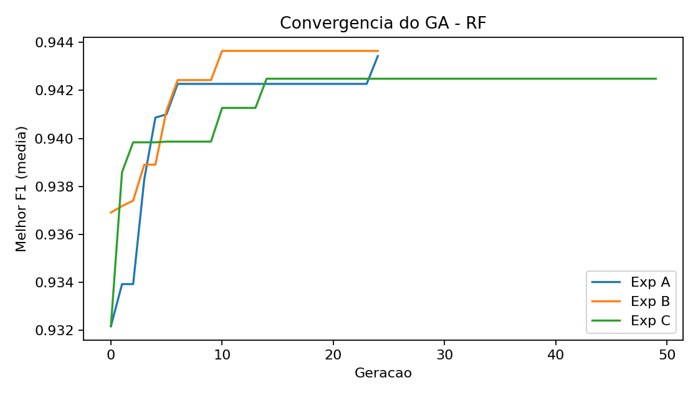
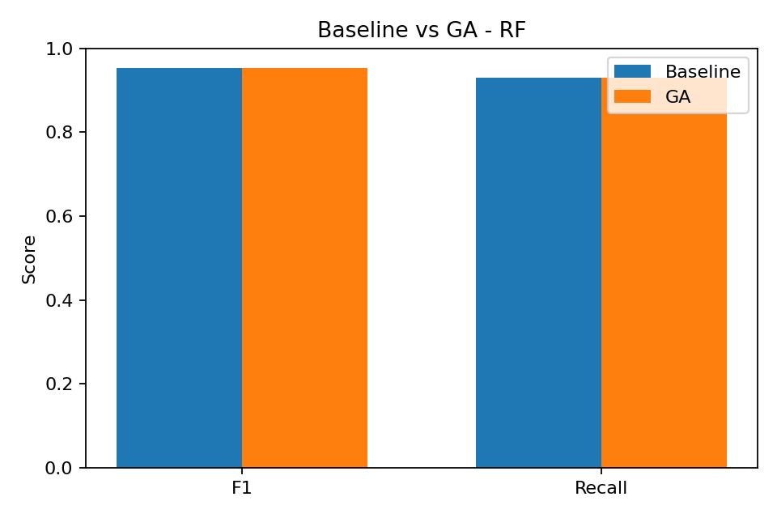
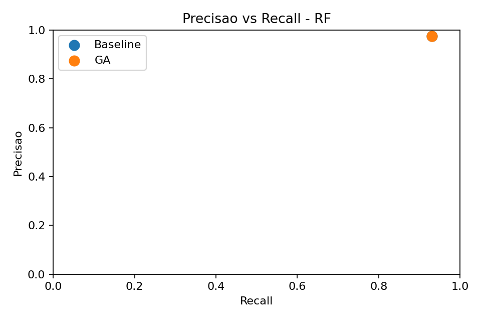

# Fase 2 - Resultados GA vs Baseline

## Tabela 1 - Baseline vs GA (melhor execucao)
| Modelo | Abordagem | Params | F1 (CV) | F1 (Holdout) | Recall | Precisao | ROC-AUC | PR-AUC |
| --- | --- | --- | --- | --- | --- | --- | --- | --- |
| LR | Baseline | C=1.0, penalty=deprecated, solver=lbfgs, class_weight=balanced |  | 0.9762 | 0.9535 | 1.0000 | 1.0000 | 1.0000 |
| LR | GA | C=0.9280682415844124, penalty=deprecated, solver=saga, class_weight=balanced | 0.9802 | 0.9882 | 0.9767 | 1.0000 | 1.0000 | 1.0000 |
| RF | Baseline | n_estimators=300, max_depth=None, min_samples_split=2, min_samples_leaf=1 |  | 0.9524 | 0.9302 | 0.9756 | 0.9980 | 0.9968 |
| RF | GA | n_estimators=409, max_depth=16, min_samples_split=5, min_samples_leaf=3 | 0.9454 | 0.9524 | 0.9302 | 0.9756 | 0.9977 | 0.9963 |

## Tabela 2 - Estabilidade do GA por experimento
| Modelo | Exp | Seeds | Melhor F1 CV (media +/- desvio) | F1 Holdout (media +/- desvio) | Recall Holdout (media +/- desvio) | Tempo medio (s) |
| --- | --- | --- | --- | --- | --- | --- |
| LR | A | 3 | 0.9773 +/- 0.0049 | 0.9802 +/- 0.0070 | 0.9612 +/- 0.0134 | 73.4 |
| LR | B | 3 | 0.9774 +/- 0.0050 | 0.9802 +/- 0.0070 | 0.9612 +/- 0.0134 | 101.2 |
| LR | C | 3 | 0.9773 +/- 0.0049 | 0.9721 +/- 0.0071 | 0.9457 +/- 0.0134 | 19.6 |
| RF | A | 3 | 0.9434 +/- 0.0044 | 0.9520 +/- 0.0007 | 0.9225 +/- 0.0134 | 391.7 |
| RF | B | 3 | 0.9436 +/- 0.0026 | 0.9482 +/- 0.0073 | 0.9225 +/- 0.0134 | 1571.1 |
| RF | C | 3 | 0.9425 +/- 0.0022 | 0.9482 +/- 0.0073 | 0.9225 +/- 0.0134 | 594.4 |

## Figuras

## Discussao critica
- LR: GA melhora o F1 no holdout de 0.9762 para 0.9882 (delta 0.0120, 1.23%).
- LR: Recall muda de 0.9535 para 0.9767, impactando falsos negativos.
- LR: Precisao muda de 1.0000 para 1.0000, afetando falsos positivos.
- LR: Diferenca entre CV e holdout de -0.0080; gaps altos sugerem overfitting.
- LR: Exp A mais estavel (menor desvio do F1 holdout).
- LR: Custo aprox 2250 avaliacoes de CV (pop 30 x gen 25 x 3 folds).
- RF: GA melhora o F1 no holdout de 0.9524 para 0.9524 (delta 0.0000, 0.00%).
- RF: Recall muda de 0.9302 para 0.9302, impactando falsos negativos.
- RF: Precisao muda de 0.9756 para 0.9756, afetando falsos positivos.
- RF: Diferenca entre CV e holdout de -0.0070; gaps altos sugerem overfitting.
- RF: Exp A mais estavel (menor desvio do F1 holdout).
- RF: Custo aprox 4500 avaliacoes de CV (pop 60 x gen 25 x 3 folds).
- Limitacoes: dataset pequeno e espaco de busca limitado; resultados sensiveis ao split.
- Proximos passos: ampliar espaco de busca, adicionar calibracao e considerar early stopping.